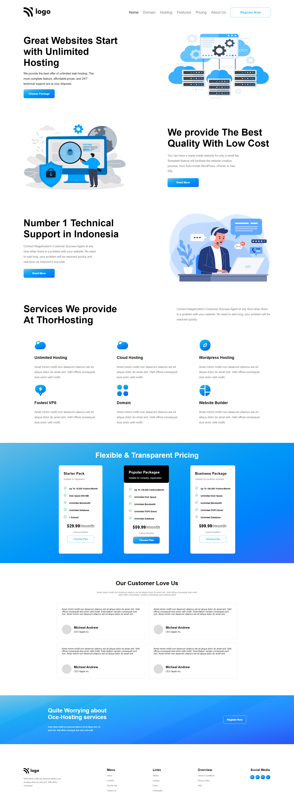

# Mohan Chindam

- Put a lot of effort into completing this project.
- As this web page is vast, I learned how to strategize and position or where to position elements.
- Used most of the properties I knew in this project. 
- Based on previous project experience, I tried to put an element where it can be arranged and also tried many other things
- Improved most of the skills better in this project.
- It took nearly ten hours to complete this project.
- Enjoyed it a lot as I tried to design a page. Flexbox made things easier.

- Below image shows the preview of the project:

I deployed the project on **Netlify**:
- You can preview the project here, [**Hosting Landing Page**](https://hosting-landing-page-11.netlify.app/)

